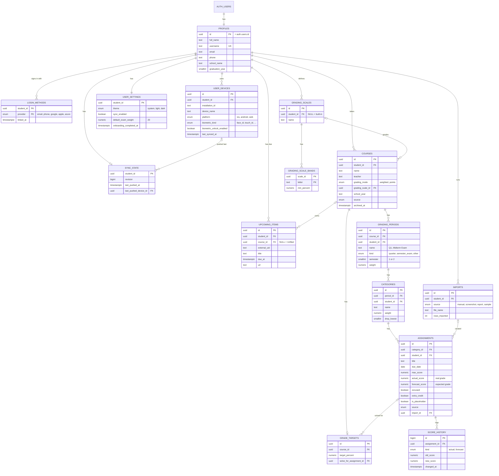

# Database design — Schoology Grade Tracker

The cloud database behind **opt-in cloud sync (F14)**. It stores each student's
account and gradebook, computes grades with the same rules as the app, and keeps
every student's data private to them.

- **Host:** [Supabase](https://supabase.com) — managed PostgreSQL you can query
  with SQL, with built-in sign-in (email, phone, Google, Apple, Microsoft).
- **SQL:** [`supabase/migrations/`](../../supabase/migrations/) (run in order).
- **Tests:** [`supabase/tests/gradebook_test.sql`](../../supabase/tests/gradebook_test.sql).
- **Sample data:** [`supabase/seed.sql`](../../supabase/seed.sql).
- **Class demo queries:** [`demo.sql`](demo.sql).

Feature IDs (F01–F14) refer to [`../mvp.md`](../mvp.md).

---

## 1. Features the database supports

| # | Feature | App feature | Where it lives |
|---|---|---|---|
| 1 | **Student account**: name, email, phone, username | F14 | `profiles` |
| 2 | **Sign-in methods**: email + password, phone code, Google, Apple, Microsoft | F14 | Supabase Auth + `login_methods` |
| 3 | **Face ID / fingerprint unlock** per device | F14 | `user_devices` |
| 4 | **Many students**, each seeing only their own data | all | `student_id` on every row + row-level security |
| 5 | **Gradebook**: course → grading period → category → assignment | F02, F03, F13 | `courses`, `grading_periods`, `categories`, `assignments` |
| 6 | **Grade calculation**: weighted and points courses, excused, ungraded, extra credit, drop-lowest, letter scale | F07 | columns on the tables above + `course_grades` view |
| 7 | **Forecast grades**: enter the score you expect | F08 | `assignments.forecast_score` |
| 8 | **Forecasts for work not posted yet** | F08 | `assignments.is_placeholder` |
| 9 | **Replace a forecast with the actual grade** | F08 | `assignments.actual_score` + `record_actual_score()` |
| 10 | **Current vs. projected grade** | F02, F08 | `course_grades` view |
| 11 | **Forecast accuracy**: how close were my forecasts? | extra | `forecast_accuracy` view |
| 12 | **Score history**: every grade and forecast change | extra | `score_history` |
| 13 | **What do I need on the final?** | F09 | `required_score()` + `grade_targets` |
| 14 | **Semester grades** (Q1 + Q2 + midterm, Q3 + Q4 + final) | F10 | `grading_periods.kind` / `semester` + `semester_grade_summary` view |
| 15 | **Letter-grade scales** (default US +/-, custom per student) | F07 | `grading_scales`, `grading_scale_bands` |
| 16 | **Import history** (screenshot, saved report, manual, sample) | F04, F05, F06 | `imports`, `assignments.source` |
| 17 | **Upcoming assignments** from the iCal feed | F11 | `upcoming_items` |
| 18 | **Settings**: theme, sync on/off, default exam weight | F01, F10, F12 | `user_settings` |
| 19 | **Sync bookkeeping**: which device pushed last | F14 | `sync_state`, `user_devices.last_synced_at` |
| 20 | **Sample gradebook** to explore the app | F01 | `load_sample_gradebook()` |

---

## 2. Entity-relationship diagram



`created_at` / `updated_at` columns are left out of the diagram.

---

## 3. Key design decisions

### Accounts and sign-in
- **Supabase Auth owns sign-in.** Passwords, OAuth tokens, and phone codes live
  in Supabase's `auth.users` table, never in our tables. When someone signs up,
  a trigger creates their `profiles`, `user_settings`, and `login_methods` rows.
- **Sign-in methods:** email + password (or magic link), phone one-time code,
  **Google**, **Apple** (required by the App Store when other social logins are
  offered), and **Microsoft** (many schools use Office 365). A student can link
  several; `login_methods` lists them.
- **Face ID / fingerprint is not a sign-in method.** The phone checks the face or
  finger, then unlocks the Supabase session already saved in the Keychain /
  Keystore. The database only stores which devices have it turned on
  (`user_devices.biometric_unlock_enabled`).
- **Email and phone** come from Supabase Auth and are copied into `profiles`.
  Students change them through Supabase Auth, which verifies the new address,
  so they cannot edit those columns directly.

### Many students, kept apart
- Every table has a `student_id`, and **row-level security (RLS)** allows a
  signed-in student to read and write only rows where `student_id` is their own
  id. This holds for the app, the API, and the views.
- Child tables use **composite foreign keys** such as
  `(period_id, student_id) → grading_periods (id, student_id)`. So even a
  correctly labeled row cannot hang off another student's course.

### Forecasts and actual grades
Each assignment has **two score columns**:

| Column | Meaning |
|---|---|
| `actual_score` | The real grade from Schoology (import or manual entry). `NULL` = not graded yet. |
| `forecast_score` | The grade the student expects. `NULL` = no forecast. |

- **Current grade** uses `actual_score` only, which matches Schoology.
- **Projected grade** uses `actual_score`, or `forecast_score` when there is no
  actual score yet.
- **Replacing a forecast with the actual grade** means setting `actual_score`
  (`record_actual_score()` does this). The actual grade then wins everywhere,
  and the forecast is **kept**, so `forecast_accuracy` can compare them.
  `score_history` logs every change.
- **Work that is not in Schoology yet** (next unit's test, the midterm) is a
  placeholder assignment: `is_placeholder = true` with only a forecast. When the
  real grade arrives, the placeholder becomes a normal assignment.
- The app's **What-If (F08)** stays on the phone, as the spec says. What-If
  changes are temporary and never touch the database. Forecasts are the saved
  version.

### Grade calculation
The app computes grades on the phone (F07), so it works offline. The database
repeats the same rules in SQL functions so grades can be queried and checked:

- **Category** = earned ÷ possible over its graded items. Excused and ungraded
  items are left out. Extra credit adds earned points only. `drop_lowest` drops
  the lowest-percent items, but always keeps at least one.
- **Period**: in a weighted course, the weighted average of the categories that
  have grades, with weights re-normalized over those categories only. In a
  points course, all points pooled.
- **Semester (F10)** = the semester's graded quarters averaged 50/50, blended
  with the exam by its weight (default 20%). A missing exam drops out.
- **Course** = the weighted average of graded periods. For courses with
  semester exams, it is the average of the semester grades instead.
- **Letter** from `grading_scale_bands`, using the default US +/- scale unless
  the course names another.
- When no row at a level has a weight, all rows at that level count equally.

`required_score(assignment, target%)` answers F09 by searching for the lowest
score that reaches the target. It reports `already_secured` or `not_possible`
when appropriate.

### Privacy
- **The iCal feed URL is not stored in the database.** It contains a
  password-equivalent token, so it stays in the phone's secure storage (F11).
  Only the fetched agenda items are synced.
- **No Schoology credentials are stored anywhere.** Grades arrive through
  screenshots, saved reports, or manual entry (F04–F06).

---

## 4. Table reference

| Table | One row per… | Notes |
|---|---|---|
| `profiles` | student | `username` is unique, lowercase, 3–30 chars; `phone` is E.164 (`+12065550123`). |
| `login_methods` | linked sign-in method | Kept in step with `auth.users` by a trigger; read-only for students. |
| `user_devices` | installed app | `biometric_unlock_enabled` needs a `biometric_kind`. |
| `user_settings` | student | Theme, sync on/off, default exam weight, onboarding done. |
| `sync_state` | student | `revision` goes up by one on every push; devices behind it pull. |
| `grading_scales` | letter scale | `student_id NULL` = built-in (US +/-). |
| `grading_scale_bands` | letter in a scale | `A- ≥ 90`, `B+ ≥ 87`, … |
| `courses` | class | `grading_mode` is `weighted` or `points`. |
| `grading_periods` | quarter or exam | `kind = semester_exam` for midterms/finals; `semester` is 1 or 2. |
| `categories` | section in a period | `weight` in percent; `drop_lowest`. |
| `assignments` | assignment | `actual_score`, `forecast_score`, `excused`, `extra_credit`, `is_placeholder`. |
| `score_history` | score change | Written by a trigger; read-only for students. |
| `grade_targets` | course with a target | Target percent and the item to solve for. |
| `imports` | committed import | Source, file name, row count. |
| `upcoming_items` | due item from the feed | `course_id NULL` = "Unfiled". |

**Views** (all respect RLS): `course_grades`, `period_grade_summary`,
`category_grade_summary`, `semester_grade_summary`, `forecast_accuracy`.

**Functions:** `course_percent`, `period_grades`, `category_grades`,
`semester_grades`, `letter_for`, `required_score`, `record_actual_score`,
`load_sample_gradebook`.

---

## 5. Hosting on Supabase

### Why Supabase
| Need | Supabase |
|---|---|
| Relational database you can query with SQL | PostgreSQL, with a SQL editor in the dashboard |
| Student sign-in with OAuth | Supabase Auth: email, phone, Google, Apple, Microsoft |
| Many students, private data | Postgres row-level security, checked on every request |
| Works with the app | `@supabase/supabase-js` works in React Native / Expo |
| Cost | Free tier, enough for a class project (at the time of writing: 500 MB database, 50,000 monthly active users) |

Alternatives: **Neon** and **Railway** host Postgres too, but have no built-in
sign-in, so a separate auth service would be needed. **Firebase** has sign-in
but is not a relational SQL database.

### Set up the database (one time)
1. In the [Supabase dashboard](https://supabase.com/dashboard), open your
   project (or create one: pick a region near you and save the database
   password).
2. Open **SQL Editor → New query**. Paste and **Run** each file in
   [`supabase/migrations/`](../../supabase/migrations/), **in filename order**:
   1. `20260924000100_accounts.sql`
   2. `20260924000200_gradebook.sql`
   3. `20260924000300_grade_engine.sql`
   4. `20260924000400_sample_gradebook.sql`
3. Check it: paste and run
   [`supabase/tests/gradebook_test.sql`](../../supabase/tests/gradebook_test.sql).
   It creates two test students, checks the grade math, forecasts, and
   privacy rules, then **rolls back**, so nothing is left behind. If it ends
   with **Success**, every check passed; a failed check stops with an error
   that starts with `FAILED:`.
4. Open **Table Editor**: you should see the tables above.

*With the Supabase CLI instead:* `supabase link --project-ref <ref>` then
`supabase db push` runs the migrations in order.

### Turn on sign-in methods
**Authentication → Sign In / Providers:**
- **Email** — on by default.
- **Phone** — needs an SMS provider (for example Twilio).
- **Google**, **Apple**, **Azure (Microsoft)** — each needs a client ID and
  secret from that company's developer console. Supabase's page for each
  provider links to the steps.

### Load the sample data
In **SQL Editor**, paste and **Run** [`supabase/seed.sql`](../../supabase/seed.sql).
It adds three demo students:

| Username | What they show |
|---|---|
| `ana_park` | 5 AP courses with forecasts. Calc: current 90.00 (A-), projected 89.00 (B+). |
| `ben_ortiz` | The same courses. Some forecasts are replaced by actual grades. Calc: 91.20 (A-). |
| `chris_lee` | One class built by hand, points grading. Chemistry: 80.77 (B-). |

Running the seed a second time does nothing. The demo students have no
password, so nobody can sign in as them.

The SQL editor runs as an admin and **bypasses RLS**, so it shows every
student's rows. The app, signed in as one student, sees only that student's rows.

### Demo in class
[`demo.sql`](demo.sql) has the queries, in three parts:
1. **Inspect the schema:** tables with row counts, columns, constraints,
   indexes, RLS policies, views, and functions.
2. **Query the data:** accounts, grades, course detail, semester grades,
   forecast accuracy, the score needed on the midterm, and upcoming items.
3. **Live change:** replace Ana's midterm forecast with an actual grade, and
   see her grade change. Query 3.4 resets it for the next demo.

**How to connect:**
- **Supabase SQL Editor** (browser, nothing to install). Sign in at
  [supabase.com/dashboard](https://supabase.com/dashboard), open the
  project, open **SQL Editor**, paste `demo.sql`, select one query, and
  press **Ctrl+Enter** (Cmd+Enter on a Mac).
- **Any SQL client** (psql, DBeaver, TablePlus, DataGrip). In the dashboard,
  click **Connect** and copy the **Session pooler** connection string. It
  works on IPv4 networks such as school Wi-Fi. For example:
  ```bash
  psql "postgresql://postgres.<project-ref>:<password>@aws-0-<region>.pooler.supabase.com:5432/postgres"
  ```
  Do not commit or show the password.

**Before class:**
- Free Supabase projects **pause after 7 days without activity**. Open the
  dashboard the day before class. If the project is paused, click
  **Restore project** and wait a few minutes.
- Run query 3.4 once, so that the live change starts from the forecast.
- Make sure the school network allows supabase.com, or use a phone hotspot.

### Connecting the app later (T3.4)
The app needs the **Project URL** and the **anon public key** from
**Project Settings → API**. The anon key is safe in the app because RLS protects
the data. Never put the **service_role** key or the database password in the
app or in this repository.

### Running the tests locally (optional)
With PostgreSQL 15+ installed: `supabase/tests/run_local.sh`. It creates a
scratch database, adds a small stand-in for Supabase's `auth` schema, applies
the migrations, runs the tests, loads the seed twice, and runs `demo.sql`.
