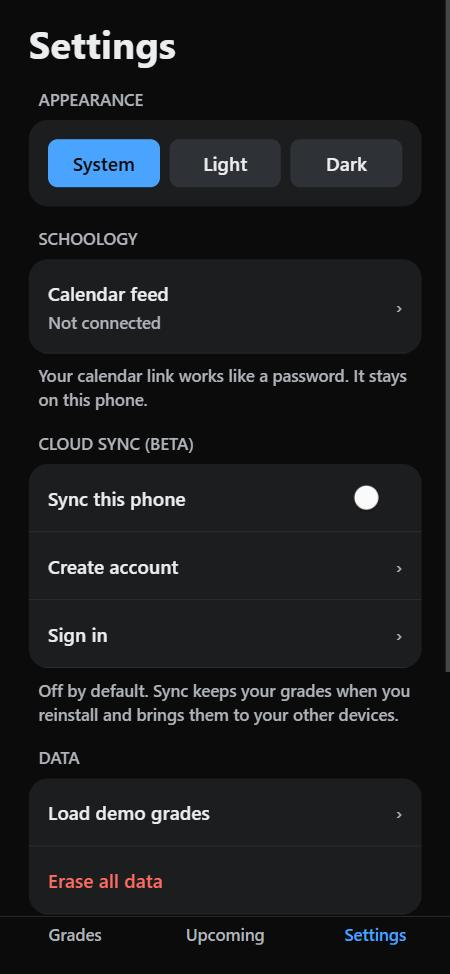
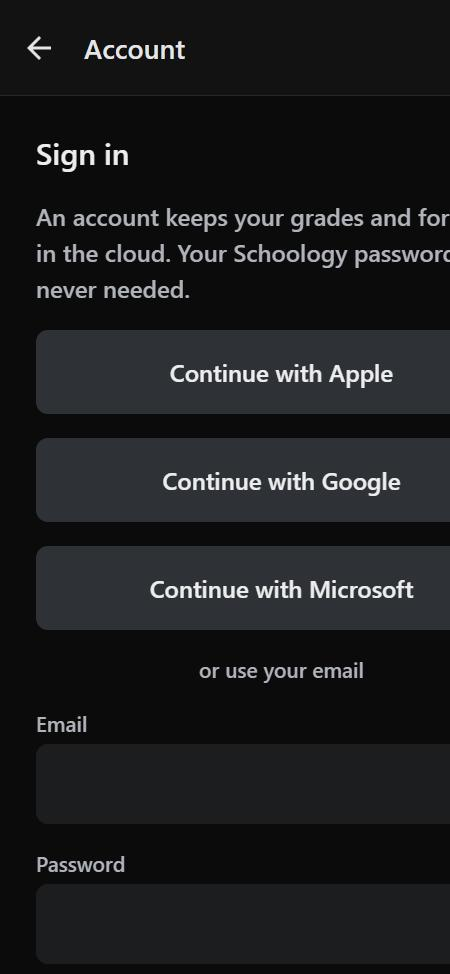

# Weekly status — week of Sep 28 – Oct 3, 2026

Branch: [`claude/grade-engine-api-layer-cu0jvt`](https://github.com/KTaehong/SchoologyGradeTracker/tree/claude/grade-engine-api-layer-cu0jvt)
· Pull request: [#5](https://github.com/KTaehong/SchoologyGradeTracker/pull/5)

## This week's tasks: Create API layer for grade engine

| Task | Status | Evidence |
|---|:--:|---|
| Current grade(s) snapshot | ✅ Done | [`6fcf2d5`](https://github.com/KTaehong/SchoologyGradeTracker/commit/6fcf2d54b7bd23ddf54175291f98739be028311c), [`969b94b`](https://github.com/KTaehong/SchoologyGradeTracker/commit/969b94b9fd07a28caaa5ddfd32077381228f9725) |
| Manual forecast — add a grade forecast to a class (persisted) | ✅ Done | [`6fcf2d5`](https://github.com/KTaehong/SchoologyGradeTracker/commit/6fcf2d54b7bd23ddf54175291f98739be028311c), [`488b139`](https://github.com/KTaehong/SchoologyGradeTracker/commit/488b1391a276dacb96d286195bc4db6483da616f) |
| Login / authenticated API calls (no session token passed to APIs) | ✅ Done | [`6fcf2d5`](https://github.com/KTaehong/SchoologyGradeTracker/commit/6fcf2d54b7bd23ddf54175291f98739be028311c), [`969b94b`](https://github.com/KTaehong/SchoologyGradeTracker/commit/969b94b9fd07a28caaa5ddfd32077381228f9725), [`488b139`](https://github.com/KTaehong/SchoologyGradeTracker/commit/488b1391a276dacb96d286195bc4db6483da616f) |
| Dependency alignment with Expo SDK | ✅ Done | [`6c47ddb`](https://github.com/KTaehong/SchoologyGradeTracker/commit/6c47ddb80b1f53b701fc619266fbe6bcdd99bc85) |

### 1. Current grades snapshot
`get_grades(course_id?)` in [`supabase/migrations/20260929000500_grade_api.sql`](../../supabase/migrations/20260929000500_grade_api.sql).
One call returns every active course (or one course) with:
- current **and** projected percent + letter,
- grading-period, category and semester grades,
- the ungraded assignments, each with its forecast (if any).

The app calls it through a typed client: `gradesApi.getGrades()` / `getCourseGrades(id)` in [`mobile/src/api/grades.ts`](../../mobile/src/api/grades.ts).

### 2. Manual forecasts (saved in the database)
| Call | What it does |
|---|---|
| `add_forecast(category_id, title, max_score, forecast_score, due_date?)` | Forecast work that isn't in Schoology yet |
| `set_forecast(assignment_id, score)` | Set or change the forecast on an ungraded assignment |
| `remove_forecast(assignment_id)` | Delete a forecast-only item, or clear a forecast |

Each call returns the course's updated grades, so the screen refreshes in one round trip.
UI: the course screen lists forecasts, and a forecast sheet adds, changes, clears or deletes them.

### 3. Authenticated API calls
- **No API function takes a user id or token.** The database reads `auth.uid()` from the request's sign-in token, and row-level security limits every row to its owner. Signed-out (`anon`) callers cannot run the functions.
- **One Supabase client** ([`mobile/src/api/client.ts`](../../mobile/src/api/client.ts)) stores the session in the phone's secure storage (Keychain / Keystore), refreshes it automatically, and attaches the token to every request. New API calls never touch tokens.
- Sign-in: email + password works today. Google / Apple / Microsoft buttons are coded (PKCE in an in-app browser) and wait on provider setup (see blockers).
- Errors use fixed codes: not signed in → 403, not found → 404, bad input → 400.

## Testing / evidence
- **Live on a phone (Expo Go, real Supabase project):** created an account, loaded sample grades, changed and added forecasts, signed out. All worked.
- **Database tests:** [`supabase/tests/grade_api_test.sql`](../../supabase/tests/grade_api_test.sql) checks the grade math against hand calculations, forecasts, input checks, and that signed-out and cross-student access is refused. Passes on the live project.
- **App tests:** typecheck clean; Jest **79 / 79 pass** (10 suites) — see [`test-run.txt`](2026-10-03/test-run.txt).

| Settings → account | Sign-in screen |
|---|---|
|  |  |

## Issues / blockers
- **Google / Microsoft sign-in:** code is done, but each provider must be turned on in the Supabase dashboard with credentials from Google Cloud / Azure. That's my next setup step.
- **Apple sign-in:** needs a paid Apple Developer account ($99/yr). Deferred.
- **Email confirmation** is on, so new accounts must click an emailed link before signing in. Fine for production; slows testing.
- **PR #5 not merged yet.** All work is committed and pushed on the branch.

## Goals for next week (Oct 5 – 11, ~5 hrs) — M1 due Fri Oct 9
1. **Merge PR #5** into `main`.
2. **Google + Microsoft sign-in working** on the phone (Supabase providers + redirect URLs).
3. **T1.3 Onboarding:** first-run "get started" screen shown once, then the grades home.
4. **T1.4 Grade engine on the phone:** the same math as the server for the offline gradebook, with tests (weighted vs points, excused/ungraded, extra credit, drop-lowest, +/- letters).
5. **T1.5 Grades home + course detail** for the on-phone gradebook: percent + letter (or N/A), periods → categories → assignments.
6. Log actual hours in [`03-velocity-tracking.md`](../project-plan/03-velocity-tracking.md) — W2 is the re-baseline checkpoint.
